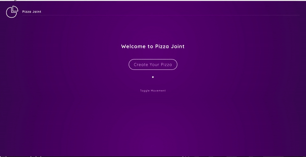

# Pizzapoint Demo

Animated with Framer-motion and React

- Go Test Here : [Site](https://pizzapoint.vercel.app)



## Prerequisites

- A modern web browser like Brave , Chrome , Firefox etc
- Node

## Getting Started

**1.** Fork [this](https://github.com/aman-atg/pizzapoint) repository :fork_and_knife:

**2.** Clone your forked repository to your local system :busts_in_silhouette:

```sh
git clone https://github.com/<your-username>/pizzapoint.git
```

Or Download and extract the zip file.

### Running

1. Install NPM packages

```sh
npm install
```

2. Run

```sh
npm start
```

3. Open your browser and go to http://127.0.0.1:3000 or https://localhost:3000

## Built With

- [ReactJs](https://reactjs.org) - A JavaScript library for building user interfaces
- [Framer-motion](https://framer.com/developers) - Framer is a tool built for interactive design.

### Authors

- **[Aman Ansari](https://github.com/aman-atg)**

### License

This project is licensed under the MIT License - see the [LICENSE.md](https://github.com/aman-atg/pizzapoint/blob/master/LICENSE) file for details
